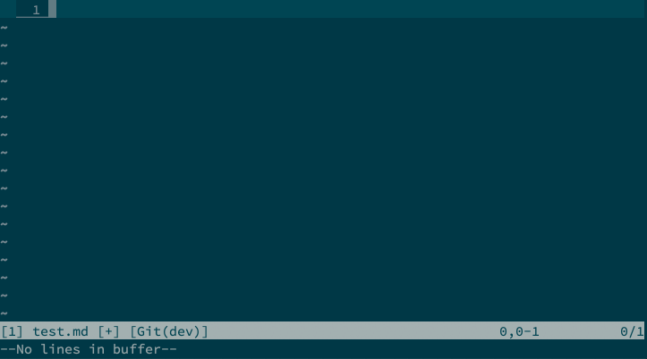

# vim-markdown-runner

Make your markdown interactive!



## Installation

Use your preferred package management tool, for paq:

```lua
require "paq" { "dbridges/vim-markdown-runner" }
```

## Usage

Place your cursor inside a fenced code block and execute `:MarkdownRunner`. This will echo the results of executing the code block. `:MarkdownRunnerInsert` will insert the results in a new fenced code block directly below. If there is an existing code block below tagged with language `markdown-runner` it will be replaced with the new results.

You might consider mapping these for easy usage:
```vim
autocmd FileType markdown nnoremap <buffer> <Leader>r :MarkdownRunner<CR>
autocmd FileType markdown nnoremap <buffer> <Leader>R :MarkdownRunnerInsert<CR>
```

For full documentation:

```
:h markdown-runner
```

## Code Type Customization

`MarkdownRunner` passes the code contained in the block to the specified language runner through stdin. By default the runner command is the same as the specified language, so

~~~
```python
print("Hello World")
```
~~~

will run with `python`.

If no source language is specified it will use `$SHELL` as the run command.

You can overwrite or specify new commands by updating the `vim.g.markdown_runners` table. Set this table's keys to either strings containing the shell commands to run, or a lua function which takes in a markdown runner object:

```lua
vim.g.markdown_runners = {
  -- Specify an alternate shell command for a certain language
  python = "python3",
  
  -- Or supply a function for customized behavior
  html = function (block)
           -- block is a table with the following properties:
           --   start_line  the beginning line number of the block
           --   end_line    the ending line number of the block
           --   cmd         the language type of the code block
           --   src         a table containing the lines of code inside the block
           return "results"  -- Return a string with the results
         end
}
```

## Builtin Runners

### Go

The Go runner will attempt to handle a variety of code blocks by (i) adding a default package declaration if one does not already exist, (ii) wrapping the entire code block in a `main` function, if `main` is not already defined, and (iii) running `goimports` on the final result. This lets you easily run code blocks without adding extra boilerplate, like this one in [`net/http`](https://golang.org/pkg/net/http/):

```go
resp, err := http.Get("http://example.com/")
if err != nil {
	// handle error
}
defer resp.Body.Close()
body, err := ioutil.ReadAll(resp.Body)
fmt.Println(string(body))
```

### Javascript

`js` and `javascript` code blocks will be run with `node`.

### Vimscript

Vimscript code blocks will be directly sourced.
